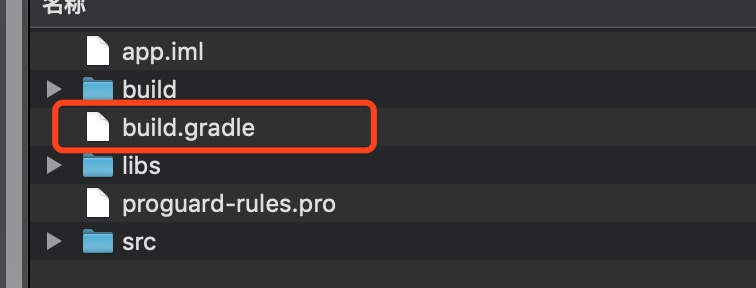
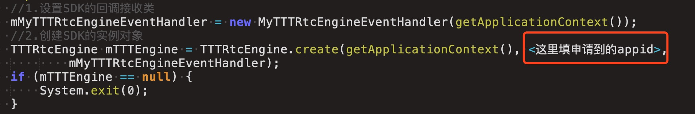

### Android 多视频源演示 Demo

#### 准备工作
1. 在三体云官网SDK下载页 [http://3ttech.cn/index.php?menu=53](http://3ttech.cn/index.php?menu=53) 下载对应平台的 连麦直播SDK。
2. 登录三体云官网 [http://dashboard.3ttech.cn/index/login](http://dashboard.3ttech.cn/index/login) 注册体验账号，进入控制台新建自己的应用并获取APPID。

#### SDK使用

1. 解压下载的 SDK 压缩包，内容如图所示

2. 用Android Studio，打开 **Android-DuoLiu Demo** 工程，文件列表如图所示，复制 **3T\_Native\_SDK\_for\_Android\_Vx.x.x\_Full.aar** 到工程 **app** 项目下的 **libs** 目录下。
 
 
3. 引用 aar 包。在 app 项目下的 build.gradle 文件中添加红框中相应代码来引用。
 
 
 

4. 将申请到的 **APPID** 填入 SDK 的初始化函数 **create** 中，如下图所示。

5. 最后编码代码即可运行Demo。

	运行环境:
    * Android Studio 3.4 +
    * minSdkVersion 16
    * gradle 5.1.1
    * java 8.0

	Android权限要求:
	
	  * **android.permission.CAMERA** ---> SDK视频模块需要使用此权限用来访问相机，用于获取本地视频数据。
     * **android.permission.RECORD_AUDIO** ---> SDK音频模块需要使用此权限用来访问麦克风，用于获取本地音频数据。
     * **android.permission.INTERNET** ---> SDK的直播和通讯功能，均需要使用网络进行上传。
     * **android.permission.BLUETOOTH** ---> SDK的直播和通讯功能，均需要访问蓝牙权限，保证用户能正常使用蓝牙耳机。
     * **android.permission.BLUETOOTH_ADMIN** ---> 蓝牙权限。
     * **android.permission.MODIFY\_AUDIO\_SETTINGS** ---> SDK的直播和通讯功能，均需要访问音频路由，保证能正常切换听筒，扬声器，耳机等路由切换。
     * **android.permission.ACCESS\_NETWORK\_STATE** ---> SDK的直播和通讯功能，均需要访问网络状态。
     * **android.permission.READ\_PHONE\_STATE** ---> SDK的直播和通讯功能，均需要访问手机通话状态。

# 常见问题
1. 由于部分模拟器会存在功能缺失或者性能问题，所以 SDK 不支持模拟器的使用。

